- Table of Contents
  {:toc}

---

Marquee GUI does not use commands, instead a more intuitive graphical interface is used.

### Creating a new checklist

To create a new checklist, either:
- click on the `New` button in the ribbon, or
- click on the `File` menu, then select `New`

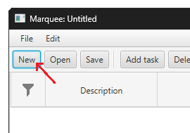
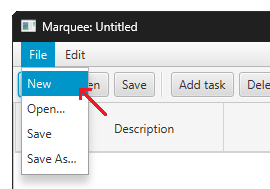

A prompt will appear, asking to save the current checklist.

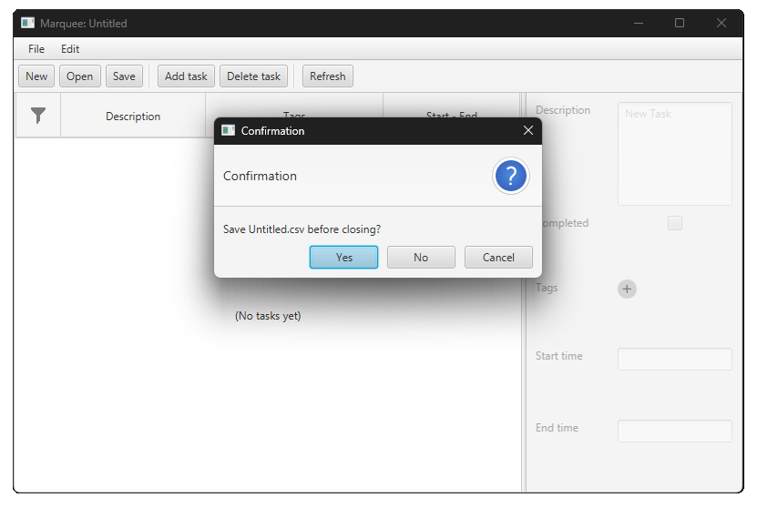

Select `Yes` to save the current checklist (refer to [Saving files](#saving-files)).

Select `No` to ignore and continue creating a new checklist.
The current checklist will not be saved.

Select `Cancel` to abort operations. Nothing will be changed.

### Opening files

To open a save file, either:
- click on the `Open` button in the ribbon, or
- click on the `File` menu, then select `Open...`

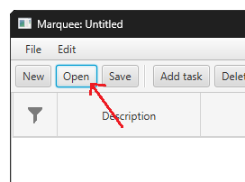
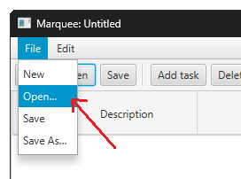

Then, a file selection pop-up will appear.

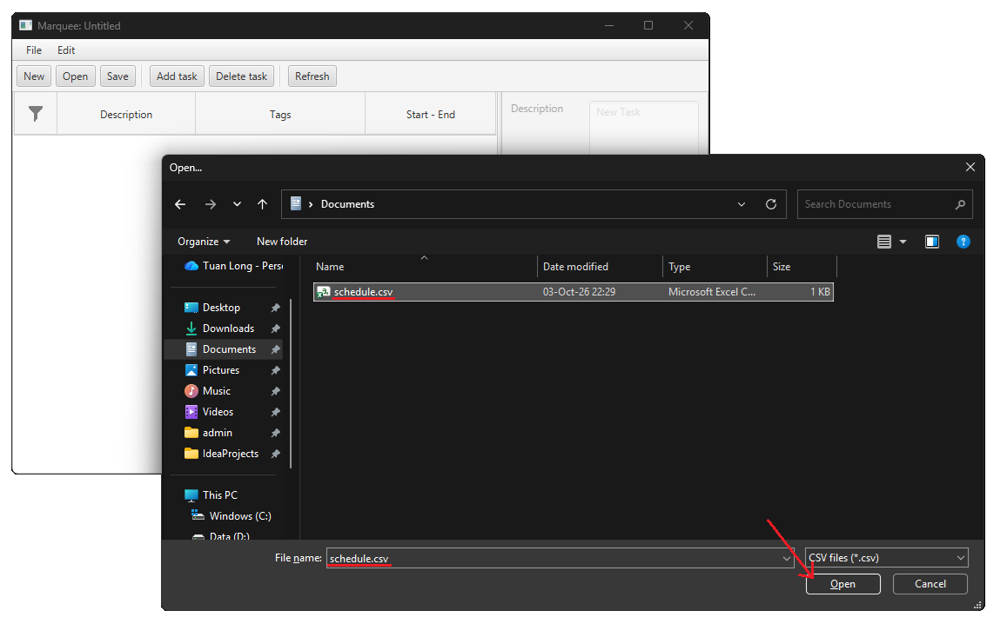

Choose the save file you want to open.
The save file must have the extension `.csv` (Comma-Separated Values).

Finally, click `Open` in the file selections pop-up.
The button location and text may differ based on your platform.

The save prompt will also show when opening a new file,
similar to when creating a new checklist
(refer to [Creating a new checklist](#creating-a-new-checklist)).

### Saving files

To save the current checklist, either:
- click on the `Save` button in the ribbon, or
- click on the `File` menu, then select `Save`

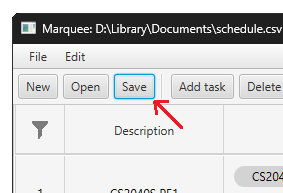
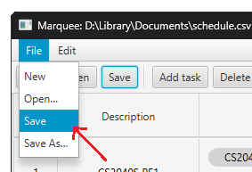

This will save the current checklist to the file you opened it from.

If the checklist is newly created, then you will be prompted to choose a
save location for the new checklist.

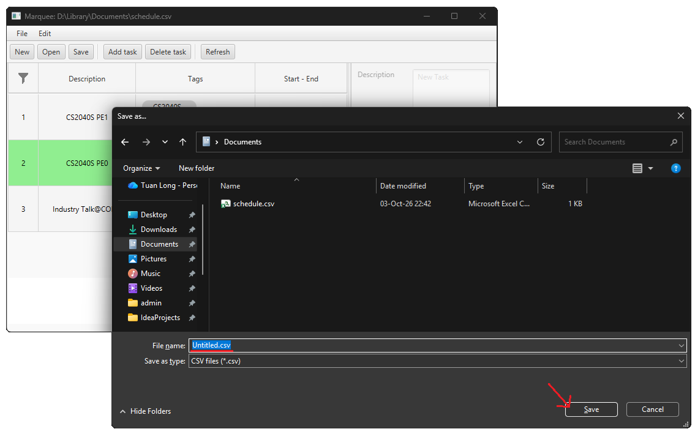

Go to the location you want to save the checklist at.
Then, choose the name of the save file.
The `.csv` extension will be automatically added.

Finally, click `Save` in the file save pop-up.
The button location and text may differ based on your platform.

You can manually save the current checklist as a new file by clicking on
the `File` menu, then select `Save as...`.

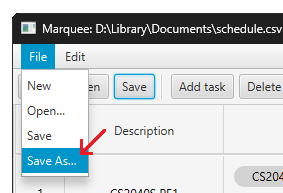

### Adding a task

To add a task, click on the `Add task` button in the ribbon.
This will add a placeholder task as seen in the image.

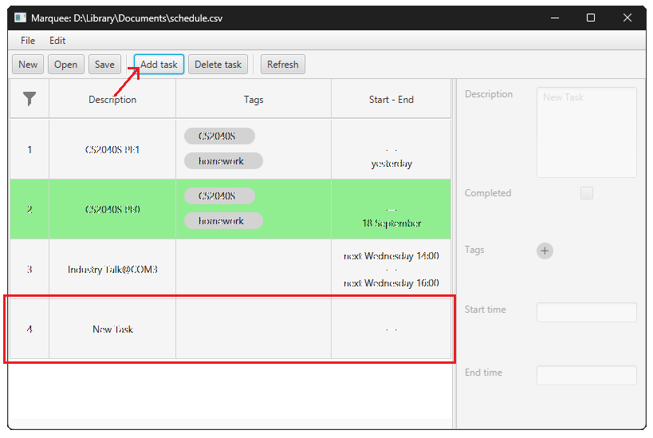

The task details can then be edited as described below
(refer to [Edit a task's name](#edit-a-tasks-name),
[Edit a task's starting or ending time](#edit-a-tasks-starting-or-ending-time),
[Marking a task as completed or incomplete](#marking-a-task-as-completed-or-incomplete),
[Adding and removing a tag to a task](#adding-and-removing-a-tag-to-a-task)).

### Edit a task's name

The task names are shown in the second column of the checklist and in the first text input.

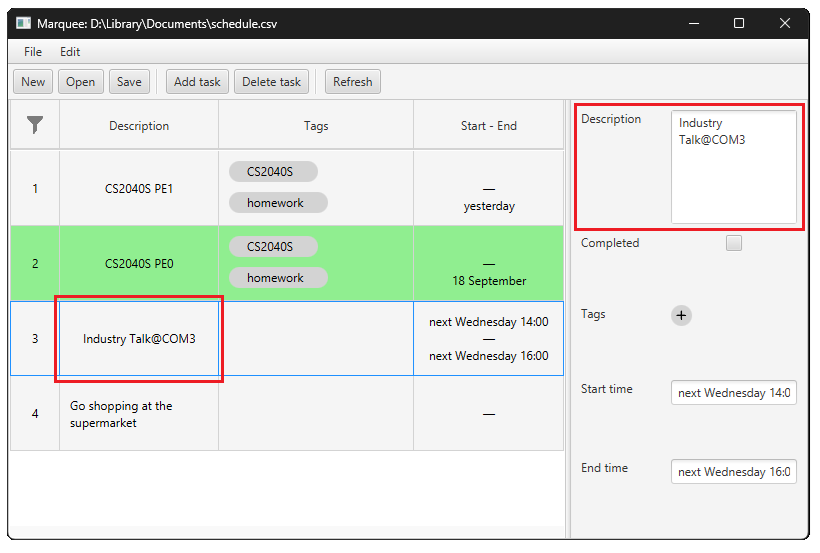

First, select the task from the list by clicking on it.
Then edit the task name in the text input.

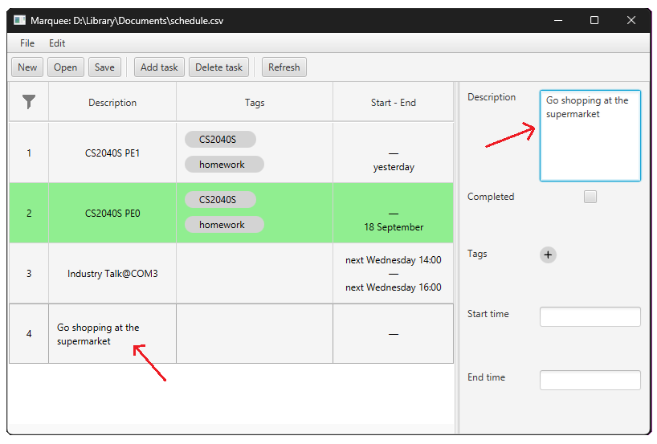

The change is reflected in the list immediately.

### Edit a task's starting or ending time

The selected tasks' starting and ending times are shown together in the last column
of the checklist, and shown in the 2 last text inputs in that order.

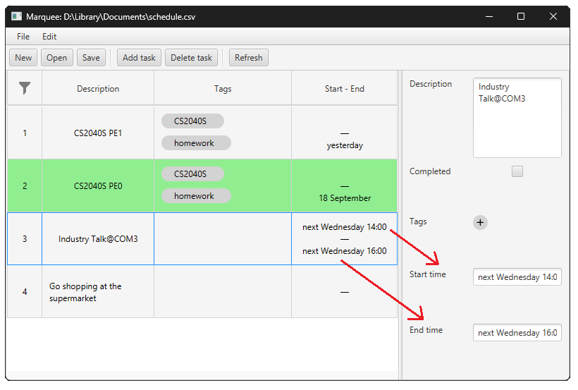

First, select the task from the list by clicking on it.
Then edit the starting or ending times in the text inputs.

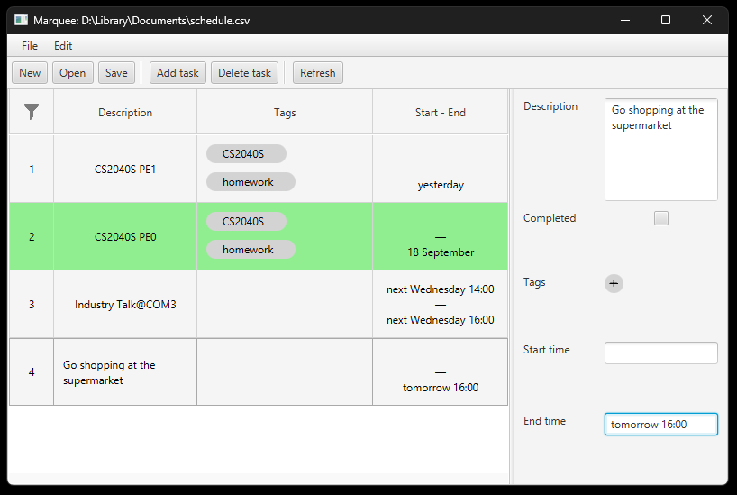

The change will be confirmed and reflected in the list after pressing `Enter`
or clicking outside the text input.

If a syntax error is detected, an error prompt will be shown and no change is committed.

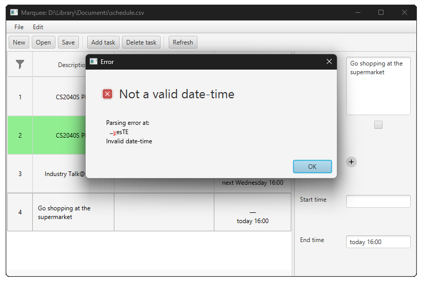

### Marking a task as completed or incomplete

The task's completion status, or mark status, is shown below the task description.
When the task is marked as completed, it is highlighted green in the checklist.

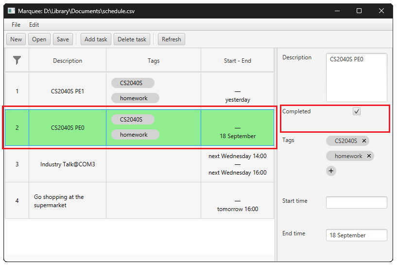

First, select the task from the list by clicking on it.
Click on the checkbox to mark the task as completed.

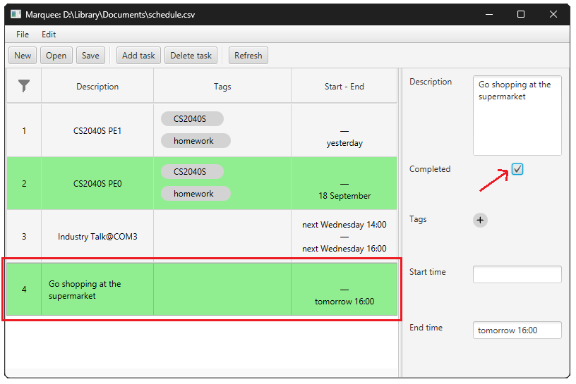

The change is reflected immediately.

### Adding and removing a tag to a task

The task tags are shown in the third column of the checklist list and above the time inputs.

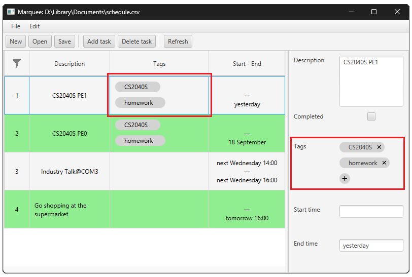

First, select the task from the list by clicking on it.
Click on the `+` button to add a tag. A tag selection pop-up will open.

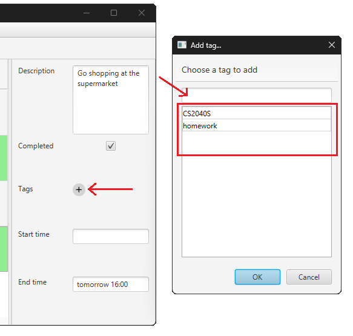

The text input is the label of the tag to be added.
The list below the input shows the existing tags.

You can click on an entry to set the input to that tag.

Type in some text.

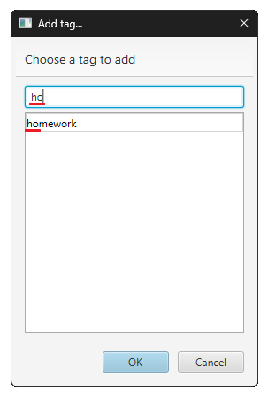

The list now shows the existing tags that contains the input text.

Now type in the tag name you want to add.

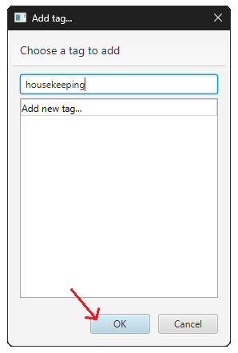

Click `OK` to confirm and add the tag to the current task.
If `Cancel` is selected, no change is made to the task and no new tags are added.

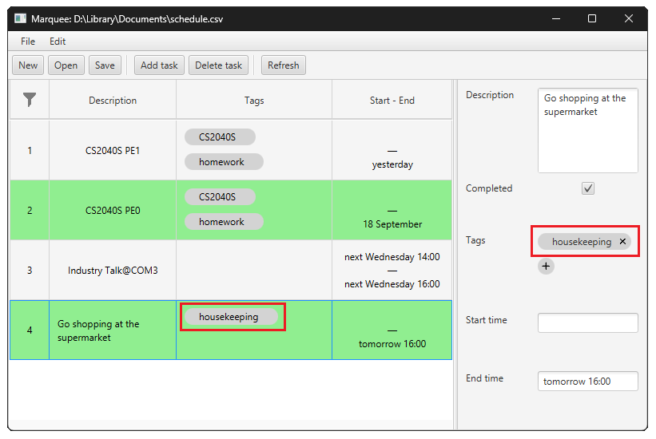

The change is reflected immediately.

To remove a tag from a task, select the task first.
Then, click the `x` button next to the tag to remove it.

The change should be reflected immediately.

### Search for specific tasks

To search for tasks with certain properties, click on the funnel-shaped button
to open the filter options pop-up.

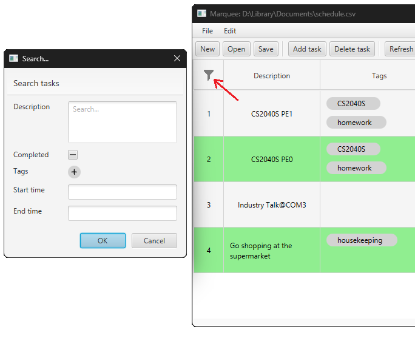

Edit the description field to filter for tasks containing this string in their descriptions.

Edit the mark status to filter for completed or incomplete task.
Set the checkbox in the `-` state to cancel filtering by mark status.

Edit the tag list to filter for tasks containing all the added tags.

Edit the start time to filter for tasks starting at or after the given time.
Tasks with no start time are not considered.

Edit the end time to filter for tasks ending at or before the given time.
Tasks with no end time are not considered.

When a filter is active, the filter button changes to a yellow color.

Some examples of filtering:

- Filter by description

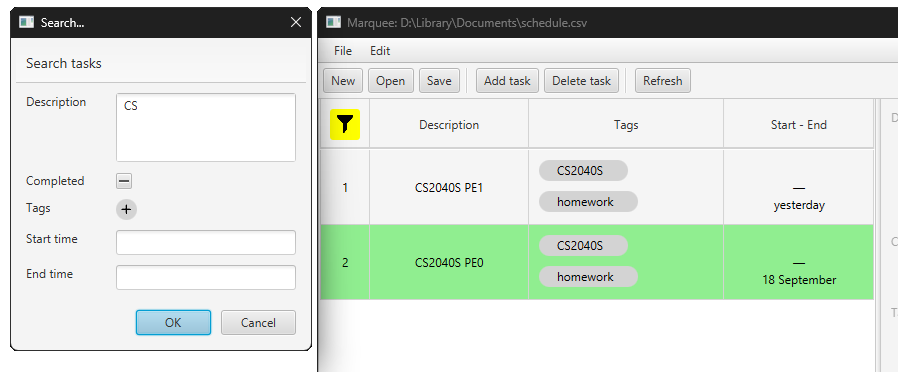

- Filter by mark status

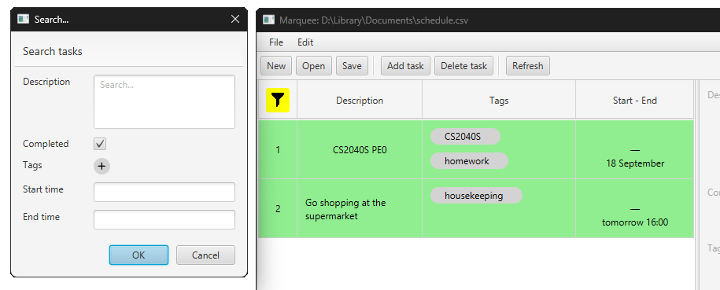

- Filter by tags

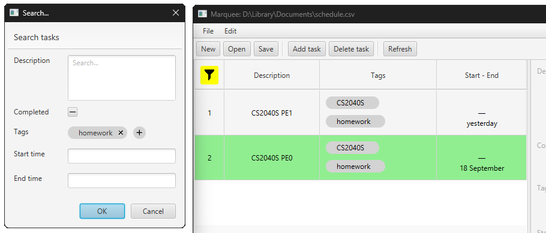

- Filter by end time

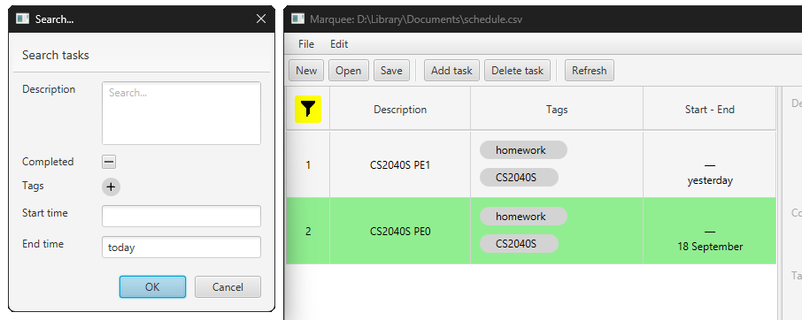