- Table of Contents
  {:toc}

---

Marquee GUI does not use commands, instead a more intuitive graphical interface is used.

### Opening files

To open a save file, either:
- click on the `Open` button in the ribbon, or
- click on the `File` menu, then select `Open...`

Then, a file selection pop-up will appear.
Choose the save file you want to open.

The save file has the extension `.csv` (Comma-Separated Values).

Finally, click `Open` in the file selections pop-up.
The button location and text may differ based on your platform.

### Saving files

To save the current checklist, either:
- click on the `Save` button in the ribbon, or
- click on the `File` menu, then select `Save`

This will save the current checklist to the file you opened it from.

If the checklist is newly created, then you will be prompted to choose a
save location for the new checklist.

Go to the location you want to save the checklist at.
Then, choose the name of the save file.
The `.csv` extension will be automatically added.

Finally, click `Save` in the file save pop-up.
The button location and text may differ based on your platform.

You can manually save the current checklist as a new file by clicking on
the `File` menu, then select `Save as...`.

### Adding a task

To add a task, click on the `Add task` button in the ribbon.
This will add a placeholder task as seen in the image.

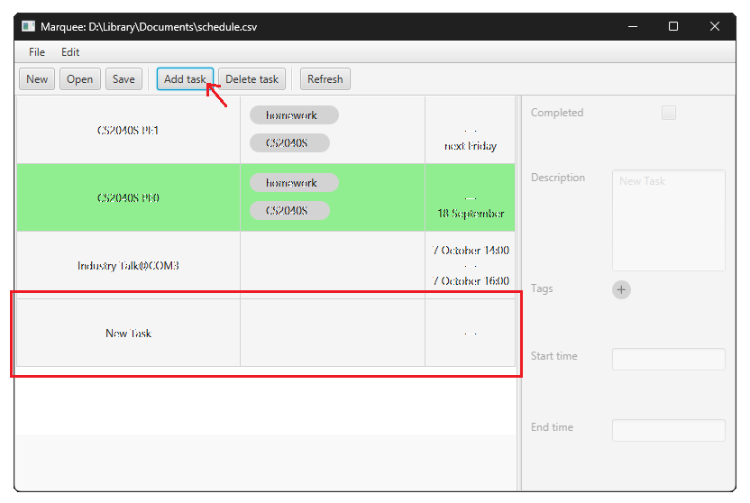

Then, the task details can be edited, as described below.

### Edit a task's name

To edit a task, select the task from the list by clicking on it.

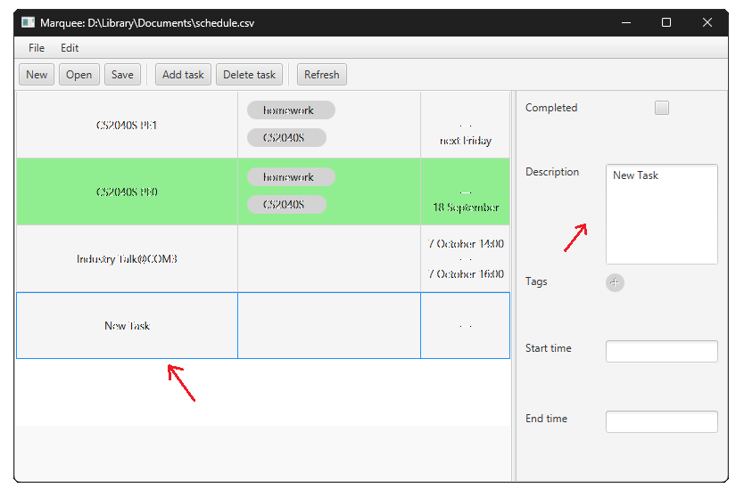

The tasks' names are shown in the first column of the checklist,
and shown in the first text input, and can be edited directly.

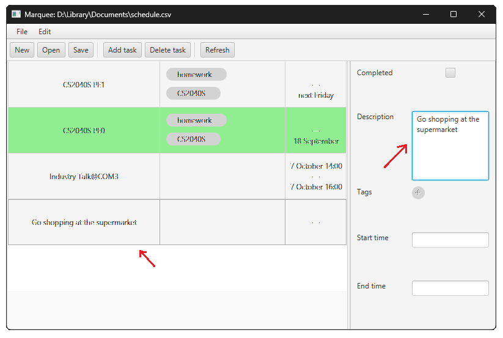

The change will be confirmed and reflected in the list after pressing `Enter`
or clicking outside the text input.

### Edit a task's starting or ending time

First select a task from the list by clicking on it.

The selected tasks' starting and ending times are shown in the last column of the checklist,
and shown in text format in the second last and last text input respectively.

The starting and ending times can be edited directly.

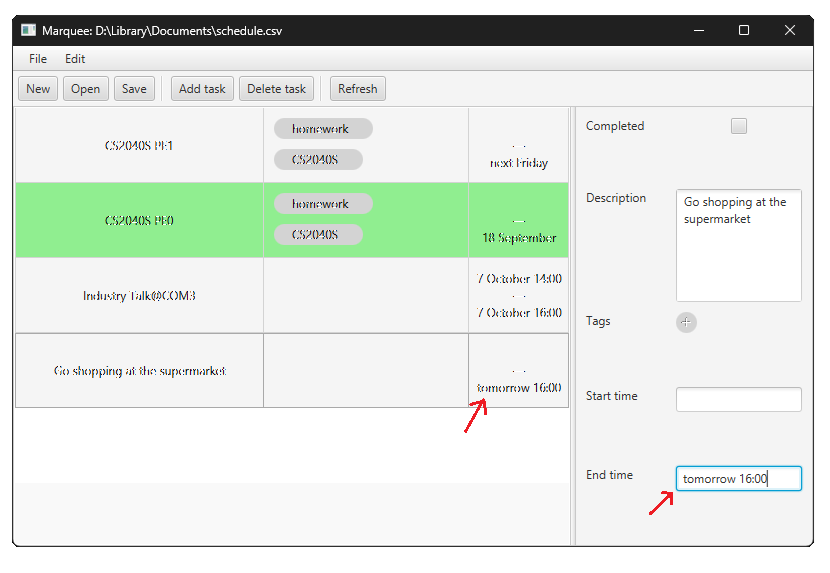

Again, the change will be confirmed and reflected in the list after pressing `Enter`
or clicking outside the text input.

### Marking a task as completed or incomplete

First select a task from the list by clicking on it.

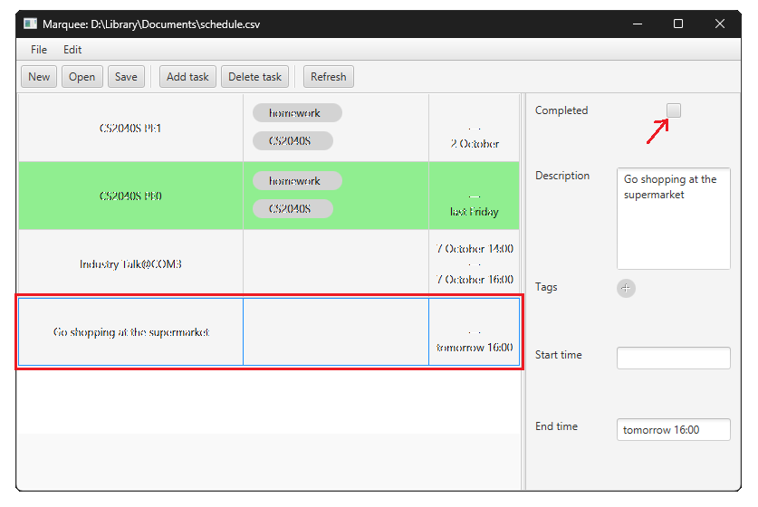

The task's completion status, or mark status, is shown above (TBA: change to below) the task description.

When the task is marked as completed, it is highlighted green in the checklist.

Click on the checkbox to mark the task as completed.
The change can be seen immediately.

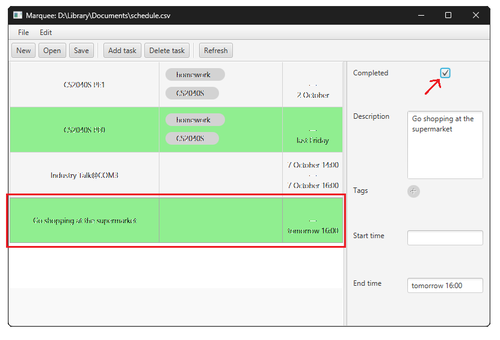

### Adding and removing a tag to a task

First select a task from the list by clicking on it.

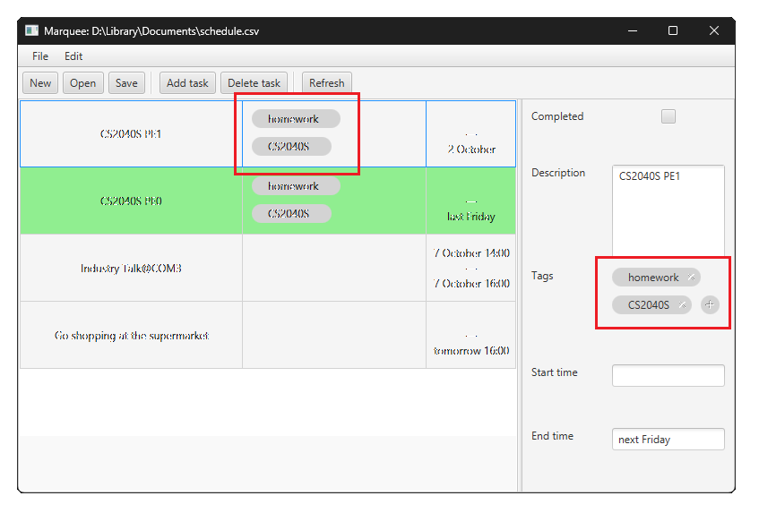

The task's tags are displayed in a list above the time fields

Now, select a tag without any tags. Click on the `+` button to add a tag.
A tag selection pop-up will open.

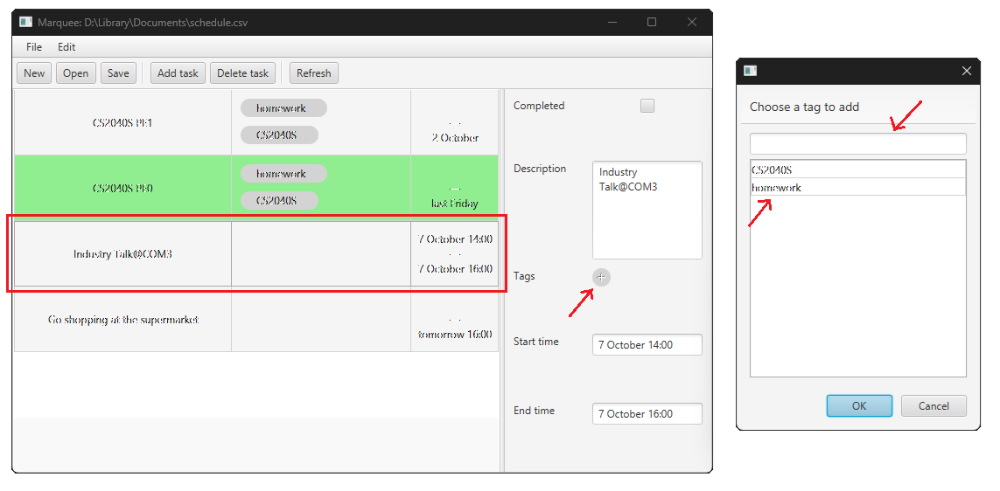

Type in the text input the tag you want to add.

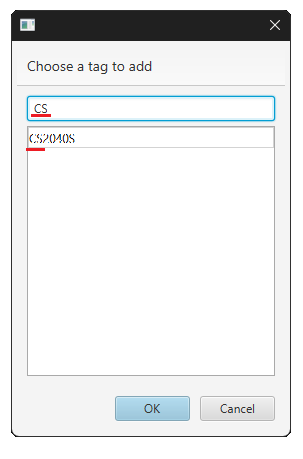

The list below the input shows the existing tags that contains the input text.
Click on an entry to set the input to that tag.

In this example, we will add a new tag.

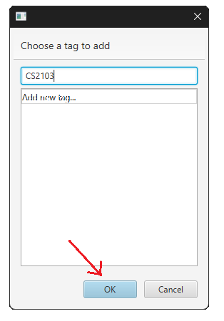

Click `OK` to confirm and add the tag to the current task.
The change is reflected immediately.

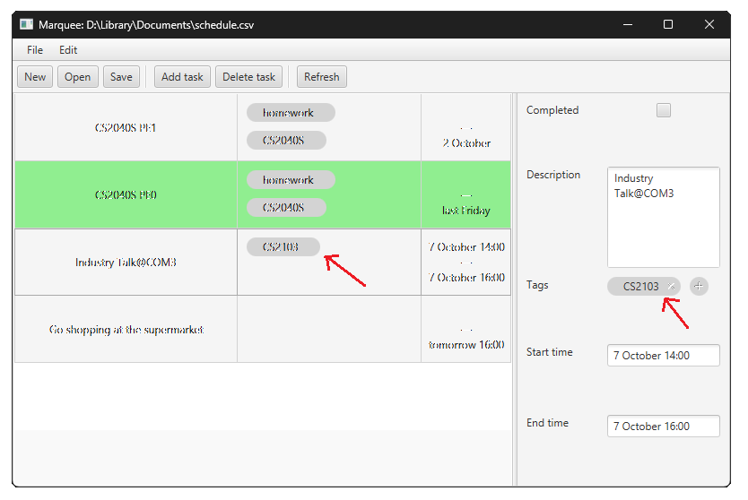

To remove a tag from a task, select the task first.
Then, click the `x` button next to the tag to remove it.

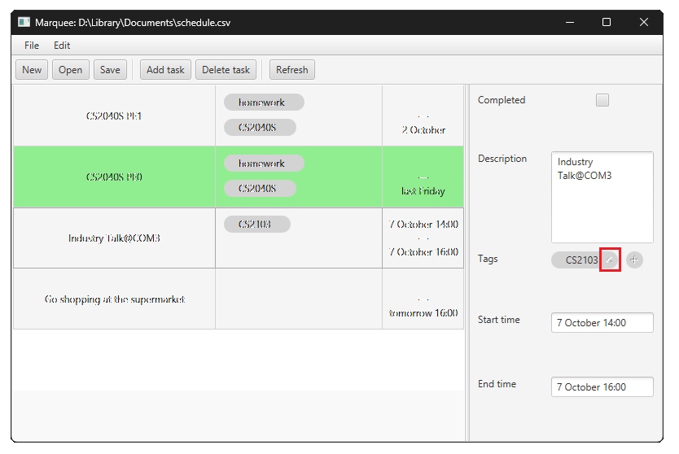