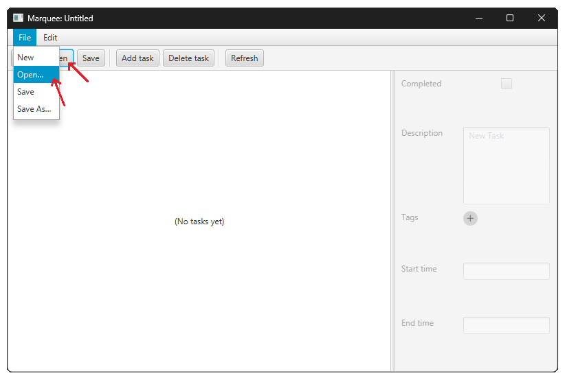
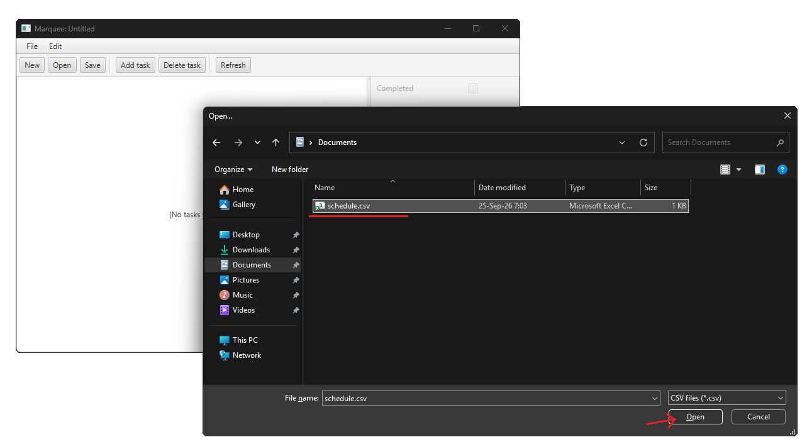
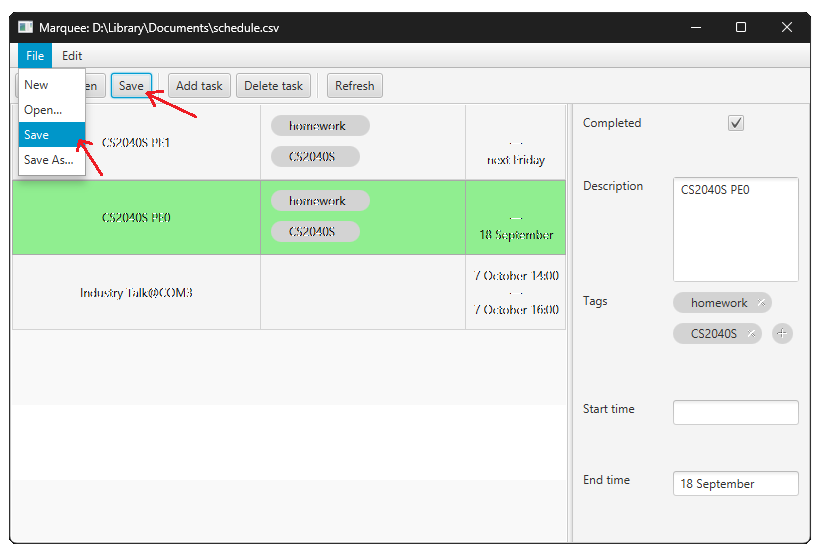
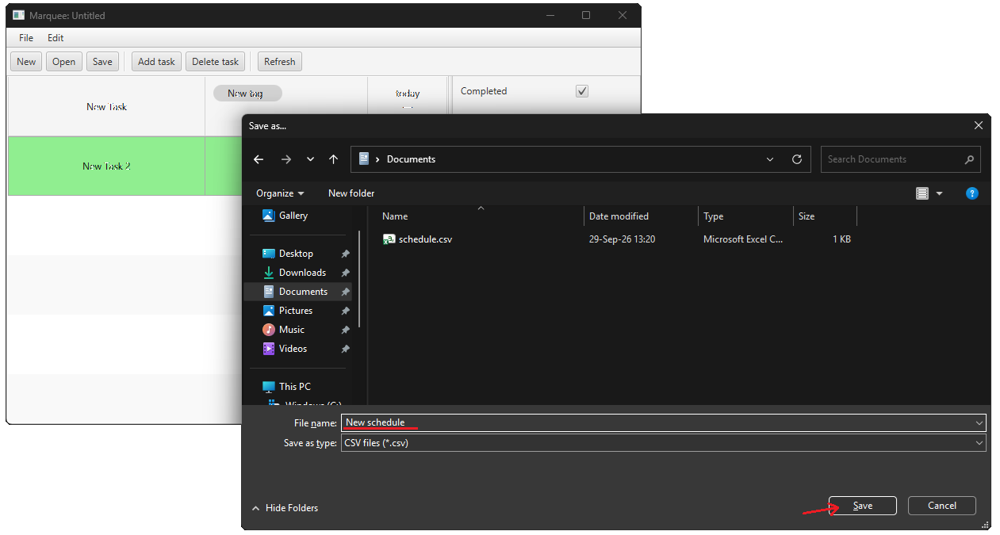
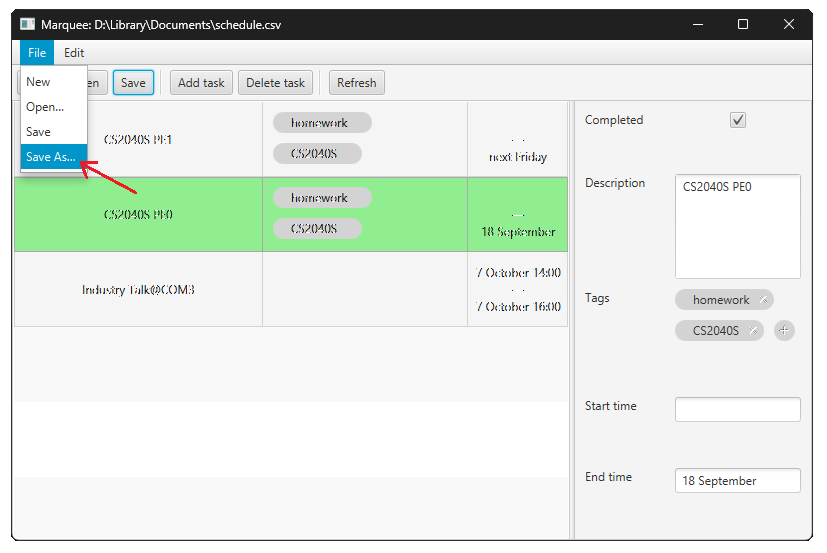

- Table of Contents
  {:toc}

---

Marquee GUI does not use commands, instead a more intuitive graphical interface is used.

### Opening files

To open a save file, either:
- click on the `Open` button in the ribbon, or
- click on the `File` menu, then select `Open...`

Then, a file selection pop-up will appear. Choose the save file you want
to open.

The save file has the extension `.csv` (Comma-Separated Values).

Finally, click `Open` in the file selections pop-up. The button location
and text may differ based on your platform.

### Saving files

To save the current checklist, either:
- click on the `Save` button in the ribbon, or
- click on the `File` menu, then select `Save`

This will save the current checklist to the file you opened it from.

If the checklist is newly created, then you will be prompted to choose a
save location for the new checklist.

Go to the location you want to save the checklist at. Then, choose the name
of the save file. The `.csv` extension will be automatically added.

Finally, click `Save` in the file save pop-up. The button location
and text may differ based on your platform.

You can manually save the current checklist as a new file by clicking on the `File` menu, then select `Save as...`.

