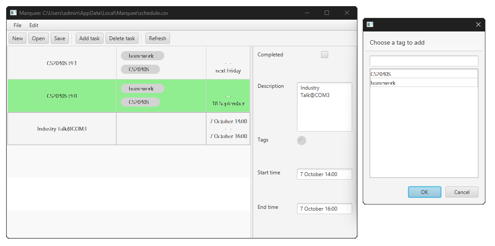

[](https://github.com/vutuanlong07/ip/releases)
[](https://github.com/vutuanlong07/ip/releases)



## Overview

Marquee is a task-keeping assistant that tries to mimic natural language to give you a smooth conversation.

This repo comes with a CLI build out of the box for Marquee.

- Guide for CLI version: [User Guide - CLI version](cli.md)

There is an additional GUI build that doesn't operate using commands if that is preferred.

- Guide for GUI version: *TBA*

For developers, a JAR containing the base features excluding the CLI and GUI application is available for download.
The JAR is fully annotated with Javadoc. Refer to the Javadoc for help.

## Features

- Manage tasks, deadlines and events
- Search for upcoming tasks
- Update tasks
- Batch task operations
- Uses CSV file format compatible with spreadsheet programs
- (CLI) Recognize many date-time formats
- (GUI) Create tags on-the-fly and add tags seamlessly

## Installation

All downloadables are located in [GitHub Release](https://github.com/vutuanlong07/ip/releases).

### CLI application

#### Use the JAR (cross-platform)

1. Make sure you have installed Java Runtime 25+
2. Download the JAR from Releases
3. Open the folder containing the JAR in your command prompt
4. Run the following command:

```bash
java -jar marquee-cli-v1.2.0-jar.jar
```

#### Use the platform-specific binaries

1. Download the binary for your platform
2. Run the binary normally (in file explorer, double-click or right click then select "Open")

### GUI application

1. Make sure you have installed Java Runtime 25+
2. Download the JAR from Releases
3. Open the folder containing the JAR in your command prompt
4. Run the following command:

```bash
java -jar marquee-cli-v1.1.0-crossplatform.jar
```

### API package

1. Download the JAR from Releases
2. Add the following to your `build.gradle` or `build.gradle.kts`:

#### Groovy

```groovy
dependencies {
    implementation files('/path/to/jar/marquee-core-v1.0.0.jar')
}
```

#### Kotlin

```kotlin
dependencies {
    implementation(files("/path/to/jar/marquee-core-v1.0.0.jar"))
}
```

**Acknowledgements**

* Libraries used: [JavaFX](https://openjfx.io/), [JUnit5](https://github.com/junit-team/junit5)